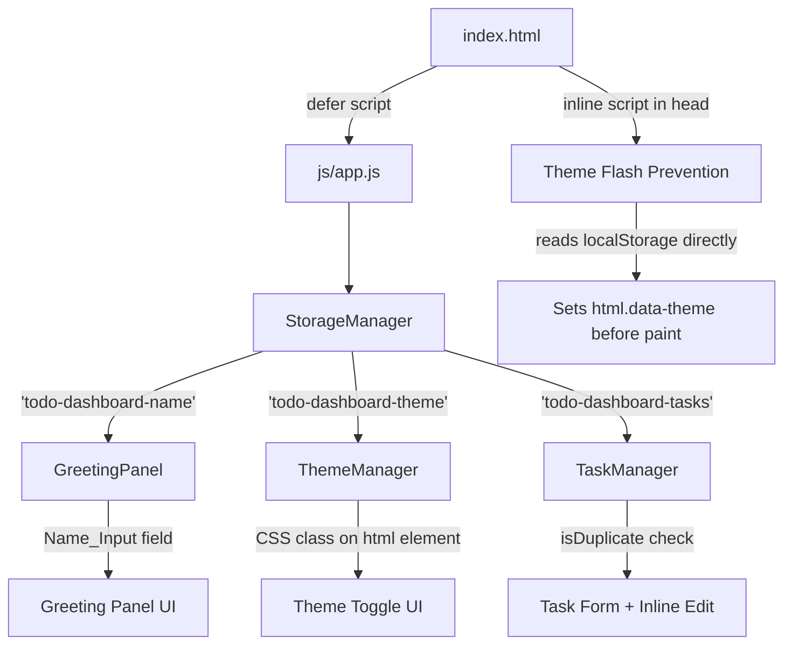
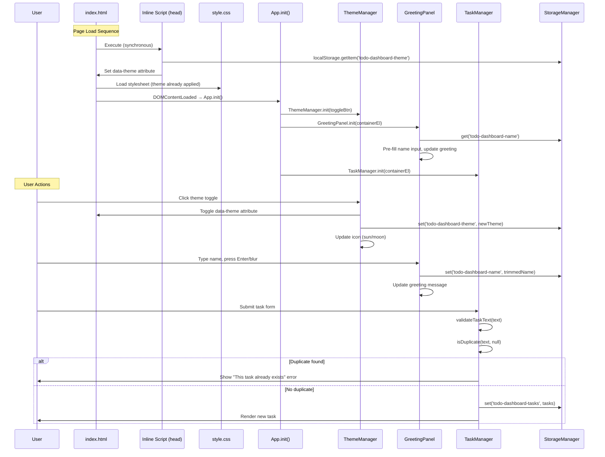

# Design Document: Dashboard Enhancements

## Overview

This design specifies three enhancements to the existing To-Do Life Dashboard:

1. **Personalized Name Entry** — A text input in the greeting panel that persists the user's name and personalizes the greeting message.
2. **Light / Dark Mode Toggle** — A theme switch in the header that toggles CSS custom properties, persists preference to localStorage, and prevents theme flash on page load.
3. **Prevent Duplicate Tasks** — Case-insensitive, trimmed text comparison on task add and inline edit, with inline error feedback.

All enhancements integrate into the existing single-file IIFE architecture without introducing frameworks, build tools, or additional script files. The application continues to work via `file://` protocol.

**Traceability:** Requirements 1, 2, 3, and 4 from `requirements.md`.

---

## Architecture

### Existing Architecture (Unchanged)

```
index.html
├── css/style.css          (CSS custom properties, responsive grid)
├── js/app.js              (IIFE with namespace pattern)
│   ├── StorageManager     (localStorage wrapper)
│   ├── GreetingPanel      (time, date, greeting display)
│   ├── FocusTimer         (25-min Pomodoro countdown)
│   ├── TaskManager        (CRUD task list)
│   ├── QuickLinks         (bookmarked URL buttons)
│   └── App                (initialization orchestrator)
```

### Enhancement Integration Points



### Design Decisions

| Decision | Choice | Rationale |
|----------|--------|-----------|
| Theme application target | `<html>` element via `data-theme` attribute | Allows CSS custom property overrides at the root level; avoids specificity conflicts |
| Flash prevention | Inline `<script>` in `<head>` before `<link rel="stylesheet">` | Synchronous execution ensures `data-theme` is set before CSS is parsed and first paint occurs |
| New module for theme | `ThemeManager` module inside existing IIFE | Keeps concerns separated; theme logic is distinct from greeting or task logic |
| Duplicate detection scope | Pure function `isDuplicate(text, tasks)` on TaskManager | Testable, reusable by both `addTask()` and `commitEdit()` |
| Name persistence trigger | `blur` and `Enter` key events | Matches existing UX pattern (task inline edit uses same triggers) |

---

## Components and Interfaces

### 1. ThemeManager (New Module)

**Responsibility:** Manages theme state, applies CSS class, persists preference, and handles the toggle control.

```javascript
const ThemeManager = {
  STORAGE_KEY: 'todo-dashboard-theme',
  THEMES: { LIGHT: 'light', DARK: 'dark' },
  _currentTheme: 'dark',
  _toggleBtn: null,

  /**
   * Initialize ThemeManager. Reads persisted theme (already applied by
   * inline script), binds toggle button event.
   * @param {HTMLElement} toggleBtn - The theme toggle button element
   */
  init(toggleBtn) { ... },

  /**
   * Toggle between light and dark themes.
   * Updates DOM, persists to localStorage, updates button icon.
   */
  toggle() { ... },

  /**
   * Apply a theme by setting data-theme attribute on <html>.
   * @param {string} theme - 'light' or 'dark'
   */
  applyTheme(theme) { ... },

  /**
   * Update the toggle button icon based on current theme.
   * Sun icon = light mode active, Moon icon = dark mode active.
   */
  _updateIcon() { ... }
};
```

**Validates:** Requirements 2.1, 2.2, 2.3, 2.5, 2.6, 2.8, 2.9, 2.10

### 2. GreetingPanel Enhancements (Modified Module)

**New additions to existing GreetingPanel:**

```javascript
// New storage key added to StorageManager.KEYS
KEYS: {
  TASKS: 'todo-dashboard-tasks',
  LINKS: 'todo-dashboard-links',
  NAME: 'todo-dashboard-name',    // NEW
  THEME: 'todo-dashboard-theme'   // NEW
}

// New properties and methods on GreetingPanel
const GreetingPanel = {
  // ... existing properties ...
  _nameInputEl: null,    // NEW: reference to the name input element
  _storedName: '',       // NEW: cached name from localStorage

  init(containerEl) {
    // ... existing init logic ...
    this._nameInputEl = containerEl.querySelector('#name-input');
    this._loadName();
    this._bindNameEvents();
    this.updateDisplay(); // existing call, now includes name
  },

  /**
   * Load saved name from localStorage.
   * Populates _storedName and pre-fills the input.
   */
  _loadName() { ... },

  /**
   * Bind blur and Enter key events on the name input
   * to persist the name value.
   */
  _bindNameEvents() { ... },

  /**
   * Validate and save the name from the input field.
   * Trims value, treats whitespace-only as empty.
   * Max 50 characters (enforced by maxlength attribute + JS validation).
   */
  _saveName() { ... },

  // MODIFIED: getGreeting now accepts optional name parameter
  /**
   * Get a greeting string based on the hour and optional name.
   * @param {number} hour - Hour in 24-hour format (0-23)
   * @returns {string} e.g., "Good Morning, Alice" or "Good Morning"
   */
  getGreeting(hour) {
    var base;
    if (hour >= 5 && hour <= 11) {
      base = 'Good Morning';
    } else if (hour >= 12 && hour <= 17) {
      base = 'Good Afternoon';
    } else {
      base = 'Good Evening';
    }
    if (this._storedName) {
      return base + ', ' + this._storedName;
    }
    return base;
  }
};
```

**Validates:** Requirements 1.1, 1.2, 1.3, 1.4, 1.5, 1.6, 1.7

### 3. TaskManager Enhancements (Modified Module)

**New method and modified existing methods:**

```javascript
const TaskManager = {
  // ... existing properties ...

  /**
   * Check if a task with the given text already exists in the task list.
   * Comparison is trimmed and case-insensitive.
   * Checks against both completed and incomplete tasks.
   * @param {string} text - The task text to check
   * @param {string|null} excludeId - Task ID to exclude (for edit operations)
   * @returns {boolean} true if a duplicate exists
   */
  isDuplicate(text, excludeId) {
    var normalizedNew = text.trim().toLowerCase();
    if (normalizedNew.length === 0) return false;
    for (var i = 0; i < this.tasks.length; i++) {
      if (excludeId && this.tasks[i].id === excludeId) continue;
      if (this.tasks[i].text.trim().toLowerCase() === normalizedNew) {
        return true;
      }
    }
    return false;
  },

  // MODIFIED: addTask now calls isDuplicate before adding
  addTask(text) {
    var validation = this.validateTaskText(text);
    if (!validation.valid) { /* ... existing logic ... */ }

    // NEW: Duplicate check
    if (this.isDuplicate(text, null)) {
      this._showError('This task already exists');
      return false;
    }
    // ... rest of existing addTask logic ...
  },

  // MODIFIED: commitEdit now calls isDuplicate before saving
  commitEdit(taskId, newText, taskEl, textSpan, inputEl) {
    // ... existing input removal ...
    var validation = this.validateTaskText(newText);
    if (validation.valid) {
      // NEW: Duplicate check for edits (exclude current task)
      if (this.isDuplicate(newText, taskId)) {
        this._showError('This task already exists');
        return;
      }
      this.editTask(taskId, newText.trim());
      textSpan.textContent = newText.trim();
    }
  }
};
```

**Validates:** Requirements 3.1, 3.2, 3.3, 3.4, 3.5, 3.6, 3.7

### 4. Inline Theme Flash Prevention Script (New)

A small inline `<script>` block added to `<head>` in `index.html`, placed **before** the CSS `<link>` tag:

```html
<head>
  <meta charset="UTF-8">
  <meta name="viewport" content="width=device-width, initial-scale=1.0">
  <title>To-Do Life Dashboard</title>
  <!-- Theme flash prevention: apply saved theme before CSS loads -->
  <script>
    (function() {
      try {
        var theme = localStorage.getItem('todo-dashboard-theme');
        if (theme === 'light' || theme === 'dark') {
          document.documentElement.setAttribute('data-theme', theme);
        } else {
          document.documentElement.setAttribute('data-theme', 'dark');
        }
      } catch(e) {
        document.documentElement.setAttribute('data-theme', 'dark');
      }
    })();
  </script>
  <link rel="stylesheet" href="css/style.css">
  <script src="js/app.js" defer></script>
</head>
```

**Validates:** Requirements 2.4, 2.5, 2.6

### 5. HTML Structure Changes (index.html)

**Header — Theme Toggle Button:**

```html
<header>
  <h1>To-Do Life Dashboard</h1>
  <button id="theme-toggle" type="button" aria-label="Toggle light/dark theme" aria-pressed="false">
    <span class="theme-icon" aria-hidden="true">&#9790;</span> <!-- Moon icon (default dark) -->
  </button>
</header>
```

**Greeting Panel — Name Input:**

```html
<section id="greeting-panel" aria-labelledby="greeting-heading">
  <h2 id="greeting-heading">Greeting</h2>
  <p id="current-time" aria-live="polite" aria-label="Current time"></p>
  <p id="current-date" aria-label="Current date"></p>
  <p id="greeting-message" aria-live="polite" aria-label="Greeting message"></p>
  <div class="name-input-wrapper">
    <label for="name-input" class="sr-only">Your name</label>
    <input
      type="text"
      id="name-input"
      placeholder="Enter your name..."
      maxlength="50"
      aria-label="Enter your name for personalized greeting"
    >
  </div>
</section>
```

### Component Interaction Diagram



---

## Data Models

### localStorage Entries

| Key | Type | Format | Default | Requirement |
|-----|------|--------|---------|-------------|
| `todo-dashboard-tasks` | JSON Array | `[{id, text, completed, createdAt}]` | `[]` | Existing |
| `todo-dashboard-links` | JSON Array | `[{id, url, label, createdAt}]` | `[]` | Existing |
| `todo-dashboard-name` | String | Plain text, trimmed, max 50 chars | `''` (empty) | Req 1.2 |
| `todo-dashboard-theme` | String | `'light'` or `'dark'` | `'dark'` | Req 2.3 |

### Theme Data Model

```javascript
// Stored value: plain string (not JSON)
// Valid values: 'light', 'dark'
// Read: localStorage.getItem('todo-dashboard-theme')
// Write: localStorage.setItem('todo-dashboard-theme', theme)
// Note: StorageManager.get() expects JSON arrays, so theme uses
//       raw localStorage access or a new getString/setString method.
```

**Design Decision:** Since `StorageManager.get()` expects JSON arrays and returns `null` or `[]`, the theme and name will use dedicated `getString`/`setString` methods added to StorageManager:

```javascript
StorageManager = {
  // ... existing methods ...

  /**
   * Retrieve a raw string value from localStorage.
   * @param {string} key
   * @returns {string|null}
   */
  getString(key) {
    try {
      return localStorage.getItem(key);
    } catch (e) {
      return null;
    }
  },

  /**
   * Store a raw string value in localStorage.
   * @param {string} key
   * @param {string} value
   * @returns {boolean}
   */
  setString(key, value) {
    try {
      localStorage.setItem(key, value);
      return true;
    } catch (e) {
      if (e.name === 'QuotaExceededError' || e.code === 22 || e.code === 1014) {
        this._showQuotaError();
      }
      return false;
    }
  }
};
```

### Name Input Data Flow

```
User types name → blur/Enter event → trim input → 
  if whitespace-only: store '' (empty), remove key →
  if valid (1-50 chars): store trimmed value →
StorageManager.setString('todo-dashboard-name', value) →
GreetingPanel._storedName = value →
GreetingPanel.updateDisplay() → greeting updates immediately
```

### CSS Custom Properties — Light Theme Overrides

```css
/* Light theme overrides applied via data-theme attribute on <html> */
html[data-theme="light"] {
  --color-bg: #f0f2f5;
  --color-surface: #ffffff;
  --color-surface-alt: #e8ecf0;
  --color-primary: #d63447;
  --color-primary-hover: #e94560;
  --color-text: #1a1a2e;
  --color-text-muted: #5a5a6e;
  --color-border: #d1d5db;
  --color-success: #38a89d;
  --color-error: #d63447;
  --color-warning: #d68a00;
  --color-timer-complete: #38a89d;
}
```

All existing CSS rules reference `var(--color-*)` properties, so switching the custom property values at the root automatically reflows the entire page. No individual element selectors need theme-specific rules.

**Validates:** Requirements 2.7 (WCAG AA contrast verified: `#1a1a2e` on `#ffffff` = 16.75:1, `#5a5a6e` on `#ffffff` = 5.74:1, `#d63447` on `#ffffff` = 4.63:1)

---

## Correctness Properties

*A property is a characteristic or behavior that should hold true across all valid executions of a system — essentially, a formal statement about what the system should do. Properties serve as the bridge between human-readable specifications and machine-verifiable correctness guarantees.*

### Property 1: Greeting format with name

*For any* valid name string (1-50 non-whitespace-only characters) and *for any* hour (0-23), the greeting output SHALL be exactly `"{TimeGreeting}, {trimmed_name}"` where TimeGreeting is determined by the hour ranges (5-11: "Good Morning", 12-17: "Good Afternoon", 18-23/0-4: "Good Evening").

**Validates: Requirements 1.4, 1.5**

### Property 2: Greeting format without name

*For any* hour (0-23) and when the stored name is empty or whitespace-only, the greeting output SHALL be exactly the TimeGreeting string without any comma or suffix.

**Validates: Requirements 1.5, 1.6**

### Property 3: Name persistence round-trip

*For any* valid name string (1-50 characters, not whitespace-only), saving the name via `_saveName()` and then loading it via `_loadName()` SHALL produce the same trimmed string.

**Validates: Requirements 1.2, 1.3**

### Property 4: Duplicate detection symmetry

*For any* two task text strings A and B, `isDuplicate(A)` returns true when B is in the list if and only if `A.trim().toLowerCase() === B.trim().toLowerCase()`.

**Validates: Requirements 3.1, 3.5**

### Property 5: Duplicate detection is case-insensitive and trim-insensitive

*For any* task text T already in the list, and *for any* string S that differs from T only by leading/trailing whitespace or letter casing, `isDuplicate(S, null)` SHALL return `true`.

**Validates: Requirements 3.1, 3.2**

### Property 6: Duplicate detection excludes self on edit

*For any* task with ID X and text T, `isDuplicate(T, X)` SHALL return `false` (a task is not considered a duplicate of itself during editing).

**Validates: Requirements 3.6**

### Property 7: Theme toggle is an involution (round-trip)

*For any* initial theme state (light or dark), toggling the theme twice SHALL return the dashboard to the original theme state, and the persisted value SHALL match the original.

**Validates: Requirements 2.2, 2.3**

### Property 8: Theme persistence round-trip

*For any* theme value in `{'light', 'dark'}`, persisting it to localStorage and then reading it back SHALL produce the same value.

**Validates: Requirements 2.3, 2.4**

---

## Error Handling

| Scenario | Handling | Requirement |
|----------|----------|-------------|
| localStorage unavailable on load | Inline script catches error, defaults to `data-theme="dark"`. App operates without persistence. | 2.6 |
| localStorage quota exceeded on name/theme save | StorageManager shows quota banner. Theme/name still applies in current session (in-memory). | 2.6, 1.2 |
| Duplicate task detected on add | Show inline error "This task already exists" in `#task-error`. Input not cleared, allowing user to modify. | 3.2, 3.3 |
| Duplicate task detected on inline edit | Reject edit silently, retain original text. Show inline error. | 3.6 |
| User clears name input | Store empty string / remove key. Greeting reverts to format without name. | 1.7 |
| Invalid theme value in localStorage | Inline script and ThemeManager treat any non-'light' value as 'dark'. | 2.5, 2.6 |
| Name input exceeds 50 chars | `maxlength="50"` attribute on input prevents browser-level entry. JS also truncates as a safety net. | 1.6 |

---

## Testing Strategy

### Unit Tests (Example-Based)

| Test | Description | Requirement |
|------|-------------|-------------|
| Theme toggle renders correct icon | Sun icon when light, moon icon when dark | 2.8 |
| Theme applies within 100ms | Measure time between click and class application | 2.2 |
| Name input pre-fills on load | Mock localStorage with stored name, verify input value | 1.3 |
| Duplicate error message displays | Add "Buy milk", attempt to add "buy milk", verify error text | 3.3 |
| Duplicate error clears on input | After duplicate rejection, type new character, verify error gone | 3.4, 3.7 |
| Inline edit duplicate rejection | Edit task to match another, verify original text retained | 3.6 |
| Non-regression: timer start/stop/reset | Verify state transitions work correctly | 4.2 |
| Non-regression: quick links CRUD | Add, delete, verify persistence | 4.4 |
| Responsive layout breakpoint | Verify single column at 768px | 4.5 |

### Property-Based Tests

Property-based testing is applicable for this feature's pure logic components (greeting formatting, duplicate detection, theme round-trip).

**Library:** [fast-check](https://github.com/dubzzz/fast-check) (JavaScript PBT library)

**Configuration:** Minimum 100 iterations per property test.

| Property Test | Design Property | Tag |
|---------------|-----------------|-----|
| Greeting format with valid name | Property 1 | Feature: dashboard-enhancements, Property 1: Greeting format with name |
| Greeting format without name | Property 2 | Feature: dashboard-enhancements, Property 2: Greeting format without name |
| Name persistence round-trip | Property 3 | Feature: dashboard-enhancements, Property 3: Name persistence round-trip |
| Duplicate detection symmetry | Property 4 | Feature: dashboard-enhancements, Property 4: Duplicate detection symmetry |
| Duplicate detection case/trim invariance | Property 5 | Feature: dashboard-enhancements, Property 5: Duplicate detection is case-insensitive and trim-insensitive |
| Duplicate excludes self | Property 6 | Feature: dashboard-enhancements, Property 6: Duplicate detection excludes self on edit |
| Theme toggle involution | Property 7 | Feature: dashboard-enhancements, Property 7: Theme toggle is an involution |
| Theme persistence round-trip | Property 8 | Feature: dashboard-enhancements, Property 8: Theme persistence round-trip |

### Integration Tests

| Test | Description | Requirement |
|------|-------------|-------------|
| Full page load with stored data | Verify theme applied, name pre-filled, tasks loaded, links loaded | 4.7 |
| file:// protocol | Open index.html directly, verify all features work | 4.6 |
| Existing data migration | Verify pre-existing tasks and links survive enhancement | 4.7 |
