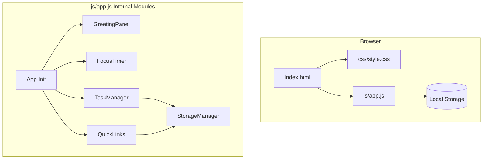
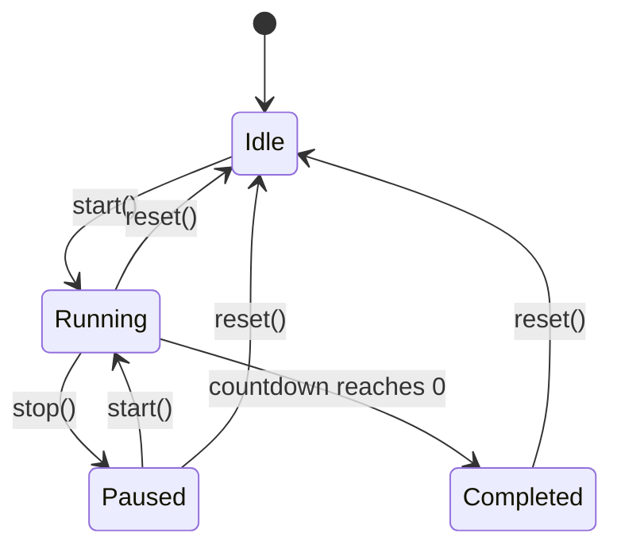

# Design Document: To-Do Life Dashboard

## Overview

The To-Do Life Dashboard is a single-page web application that provides a personal productivity hub composed of four main panels: a Greeting Panel (time/date/greeting), a Focus Timer (25-minute Pomodoro countdown), a Task Manager (CRUD to-do list), and a Quick Links Panel (bookmarked URLs). The entire application is built with Vanilla HTML, CSS, and JavaScript — no frameworks, no build tools, no backend. All user data is persisted via the browser's Local Storage API. The app must function when opened directly via the `file://` protocol.

The design prioritizes simplicity, maintainability (single JS file, single CSS file), accessibility (WCAG AA), and responsiveness (single-column at ≤768px viewport width).

## Architecture

The application follows a modular-within-a-single-file architecture. All JavaScript lives in `js/app.js`, organized into clearly separated sections using an IIFE (Immediately Invoked Function Expression) pattern or a module-like namespace object to avoid polluting the global scope.



### Key Architectural Decisions

1. **Single-file JS with logical modules**: Rather than separate files (which would require a bundler or multiple `<script>` tags), we use a single `app.js` with clear section comments and namespace objects (e.g., `App.GreetingPanel`, `App.FocusTimer`, etc.). This satisfies Requirement 10 while keeping concerns separated.

2. **No frameworks**: All DOM manipulation uses `document.createElement`, `querySelector`, and event delegation. This keeps the app zero-dependency and functional via `file://`.

3. **StorageManager abstraction**: A thin wrapper around `localStorage` that handles JSON serialization/deserialization, error recovery (corrupted data), and provides a consistent API for both TaskManager and QuickLinks.

4. **Event-driven updates**: Each module manages its own DOM section. Interactions are handled through event listeners attached during initialization. No custom event bus is needed given the simplicity.

5. **Timer accuracy via drift correction**: The Focus Timer uses `setInterval` with periodic drift correction by comparing elapsed real time (`Date.now()`) against expected elapsed time.

## Components and Interfaces

### 1. App (Initialization)

```javascript
const App = {
  init() // Called on DOMContentLoaded; initializes all modules
};
```

### 2. GreetingPanel

```javascript
const GreetingPanel = {
  init(containerEl)          // Set up time/date display, start update interval
  updateDisplay()            // Refresh time, date, and greeting text
  formatTime(date)           // Returns "HH:MM AM/PM" string
  formatDate(date)           // Returns "DayOfWeek, Month Day" string
  getGreeting(hour)          // Returns greeting string based on hour (0-23)
};
```

**Behavior:**
- On init, renders current time/date/greeting immediately.
- Sets a `setInterval` at 1-second granularity, updating the displayed minute only when it changes (avoiding unnecessary DOM writes).
- Re-evaluates greeting on every minute change.

### 3. FocusTimer

```javascript
const FocusTimer = {
  init(containerEl)          // Set up timer display and buttons
  start()                    // Begin/resume countdown
  stop()                     // Pause countdown
  reset()                    // Reset to 25:00
  tick()                     // Called each second; updates display
  formatTime(totalSeconds)   // Returns "MM:SS" string
  onComplete()               // Handle timer reaching 00:00

  // State
  state: 'idle' | 'running' | 'paused' | 'completed'
  remainingMs: number        // Milliseconds remaining
  lastTickTime: number       // Date.now() of last tick for drift correction
};
```

**State Machine:**



**Button State Matrix:**

| Timer State | Start Btn | Stop Btn | Reset Btn |
|-------------|-----------|----------|-----------|
| Idle        | Enabled   | Disabled | Disabled  |
| Running     | Disabled  | Enabled  | Enabled   |
| Paused      | Enabled   | Disabled | Enabled   |
| Completed   | Disabled  | Disabled | Enabled   |

### 4. TaskManager

```javascript
const TaskManager = {
  init(containerEl)                  // Set up task list, input, event listeners
  addTask(text)                      // Validate and add new task
  editTask(taskId, newText)          // Update task text
  toggleComplete(taskId)             // Toggle done state
  deleteTask(taskId)                 // Remove task
  renderTask(task)                   // Create DOM element for a task
  renderAll()                        // Render full list from state
  validateTaskText(text)             // Returns {valid, error}
  startEditing(taskEl, task)         // Enter inline edit mode
  commitEdit(taskId, newText)        // Save or discard edit

  // State
  tasks: Array<Task>                 // In-memory task list
};
```

**Validation Rules:**
- Text must contain at least one non-whitespace character.
- Text must not exceed 256 characters.
- Text is trimmed before storage.

### 5. QuickLinks

```javascript
const QuickLinks = {
  init(containerEl)                  // Set up links display, form, event listeners
  addLink(url, label)                // Validate and add new link
  deleteLink(linkId)                 // Remove link
  renderLink(link)                   // Create button element
  renderAll()                        // Render full list from state
  validateLink(url, label)           // Returns {valid, errors[]}

  // State
  links: Array<QuickLink>            // In-memory link list
  MAX_LINKS: 20
};
```

**Validation Rules:**
- URL must start with `http://` or `https://`.
- URL must not exceed 2048 characters.
- Label must be between 1 and 50 characters (after trimming).
- Maximum 20 links total.

### 6. StorageManager

```javascript
const StorageManager = {
  get(key)                // Parse JSON from localStorage; return null on error
  set(key, value)         // Serialize to JSON and store
  remove(key)             // Remove key from localStorage
  isValid(key)            // Check if stored value is valid JSON array

  KEYS: {
    TASKS: 'todo-dashboard-tasks',
    LINKS: 'todo-dashboard-links'
  }
};
```

**Error Recovery:** If `JSON.parse` throws or the stored value is not an array, `get()` returns `null` and the caller resets to an empty array (per Requirement 8.3).

## Data Models

### Task

```javascript
{
  id: string,          // Unique identifier (timestamp-based: `task_${Date.now()}_${Math.random().toString(36).slice(2,7)}`)
  text: string,        // Task description (1-256 chars, trimmed)
  completed: boolean,  // Completion state
  createdAt: number    // Timestamp of creation (Date.now())
}
```

### QuickLink

```javascript
{
  id: string,          // Unique identifier (same generation pattern as Task)
  url: string,         // Full URL (http:// or https://, max 2048 chars)
  label: string,       // Display label (1-50 chars, trimmed)
  createdAt: number    // Timestamp of creation (Date.now())
}
```

### Local Storage Schema

| Key | Type | Description |
|-----|------|-------------|
| `todo-dashboard-tasks` | `Task[]` | Array of task objects in insertion order |
| `todo-dashboard-links` | `QuickLink[]` | Array of link objects in insertion order |

## Correctness Properties

*A property is a characteristic or behavior that should hold true across all valid executions of a system — essentially, a formal statement about what the system should do. Properties serve as the bridge between human-readable specifications and machine-verifiable correctness guarantees.*

### Property 1: Time formatting correctness

*For any* valid Date object, `formatTime(date)` SHALL produce a string matching the pattern `HH:MM AM|PM` where HH is in [1,12], MM is in [00,59], and the AM/PM indicator is correct relative to the 24-hour value; and `formatDate(date)` SHALL produce a string containing a valid English day-of-week name, a valid English month name, and the correct numeric day of the month.

**Validates: Requirements 1.1, 1.2**

### Property 2: Greeting maps to correct time period

*For any* hour value in [0, 23], `getGreeting(hour)` SHALL return "Good Morning" if hour is in [5,11], "Good Afternoon" if hour is in [12,17], and "Good Evening" if hour is in [18,23] or [0,4].

**Validates: Requirements 2.1, 2.2, 2.3**

### Property 3: Timer display formatting

*For any* non-negative integer of total seconds up to 5999 (99:59), `formatTime(totalSeconds)` SHALL produce a string in MM:SS format where the minutes and seconds are zero-padded and mathematically correct (minutes = floor(totalSeconds/60), seconds = totalSeconds % 60).

**Validates: Requirements 3.1**

### Property 4: Button state consistency with timer state

*For any* timer state (idle, running, paused, completed), the enabled/disabled state of the start, stop, and reset buttons SHALL match the defined state matrix: idle → [start:enabled, stop:disabled, reset:disabled], running → [start:disabled, stop:enabled, reset:enabled], paused → [start:enabled, stop:disabled, reset:enabled], completed → [start:disabled, stop:disabled, reset:enabled].

**Validates: Requirements 3.3, 3.5, 3.7**

### Property 5: Valid task addition

*For any* string containing at least one non-whitespace character and at most 256 characters, calling `addTask(text)` SHALL increase the task list length by exactly one, the new task SHALL appear as the last item with `completed: false` and its text equal to the trimmed input, and the input field SHALL be cleared to empty.

**Validates: Requirements 4.1, 4.4, 4.5**

### Property 6: Task validation rejects invalid input

*For any* string that is empty, contains only whitespace characters, or exceeds 256 characters, calling `addTask(text)` SHALL not modify the task list (length unchanged) and SHALL not modify Local Storage.

**Validates: Requirements 4.3, 4.6**

### Property 7: Task persistence round-trip

*For any* sequence of task operations (add, edit, complete, delete), the tasks stored in Local Storage SHALL be deserializable back into the same array of Task objects with identical id, text, completed, and createdAt fields, preserving insertion order.

**Validates: Requirements 4.2, 5.2, 6.3, 7.2, 8.1, 8.2**

### Property 8: Invalid edit preserves original task text

*For any* existing task and any edit string that is empty or contains only whitespace characters, committing the edit SHALL leave the task's text unchanged in both the list and Local Storage.

**Validates: Requirements 5.3**

### Property 9: Completion toggle is an involution

*For any* task, calling `toggleComplete(taskId)` twice SHALL return the task to its original completion state (completed field unchanged), and after a single toggle, the visual state (strikethrough present/absent) SHALL match the new completed boolean.

**Validates: Requirements 6.1, 6.2, 6.4**

### Property 10: Task deletion reduces list size

*For any* non-empty task list and any task in that list, calling `deleteTask(taskId)` SHALL reduce the list length by exactly one, the deleted task SHALL not appear in the list or in Local Storage, and all other tasks SHALL remain in their original order.

**Validates: Requirements 7.1, 7.2**

### Property 11: Valid link addition and persistence round-trip

*For any* URL starting with "http://" or "https://" that does not exceed 2048 characters, and any label between 1 and 50 characters (trimmed), and when the total link count is below 20, calling `addLink(url, label)` SHALL add the link to the list, persist it to Local Storage, and upon reload the same links SHALL appear in insertion order.

**Validates: Requirements 9.1, 9.3, 9.4**

### Property 12: Link validation rejects invalid input

*For any* URL that does not start with "http://" or "https://", or exceeds 2048 characters, or any label that is empty or exceeds 50 characters, calling `addLink(url, label)` SHALL not modify the link list and SHALL not modify Local Storage.

**Validates: Requirements 9.6**

### Property 13: Link deletion removes from list and storage

*For any* existing link in the list, calling `deleteLink(linkId)` SHALL remove it from both the displayed list and Local Storage, with all other links remaining in their original order.

**Validates: Requirements 9.5**

### Property 14: Corrupted storage recovery

*For any* string value stored under the tasks or links storage key that is not valid JSON or is valid JSON but not an array, the system SHALL recover by returning an empty list and resetting the storage key to an empty JSON array.

**Validates: Requirements 8.3**

## Error Handling

### Input Validation Errors

| Scenario | Behavior |
|----------|----------|
| Task text empty/whitespace-only | Silently reject; no error message displayed (no-op) |
| Task text > 256 characters | Display inline error below input: "Task must be 256 characters or fewer" |
| Link URL missing http(s):// prefix | Display inline error: "URL must start with http:// or https://" |
| Link URL > 2048 characters | Display inline error: "URL must be 2048 characters or fewer" |
| Link label empty | Display inline error: "Label is required" |
| Link label > 50 characters | Display inline error: "Label must be 50 characters or fewer" |
| Link count at maximum (20) | Display inline error: "Maximum of 20 quick links reached" |

### Storage Errors

| Scenario | Behavior |
|----------|----------|
| localStorage unavailable (private browsing, quota exceeded) | Catch exception, display a non-blocking warning banner: "Storage unavailable — changes won't persist across sessions" |
| Corrupted data (invalid JSON or non-array) | Reset the affected key to `[]`, render empty list, log warning to console |
| Storage quota exceeded on write | Catch `QuotaExceededError`, display inline error: "Storage full — please delete some items" |

### Timer Edge Cases

| Scenario | Behavior |
|----------|----------|
| Tab becomes inactive (background) | On visibility change, recalculate remaining time from elapsed real time to correct drift |
| Timer reaches exactly 0 | Transition to completed state, clear interval, apply visual indicator |

### General Error Strategy

- All user-facing error messages are shown inline next to the relevant input, not as alert dialogs.
- Error messages are associated with their input via `aria-describedby` for screen reader accessibility.
- Errors auto-clear when the user begins typing new input.
- No errors are thrown to the global scope; all are caught and handled locally.

## Testing Strategy

### Test Framework

- **Unit & Property Tests**: [fast-check](https://github.com/dubzzz/fast-check) for property-based testing, run via a simple HTML test runner (since no build tools) or optionally via Node.js for CI.
- **Unit Tests**: Vanilla assertion functions or a lightweight library like `uvu` (zero-dep, runs in Node).

### Property-Based Tests

Each correctness property (Properties 1–14) will be implemented as a property-based test using fast-check with a minimum of **100 iterations** per property.

**Configuration:**
- Library: `fast-check` (installed via npm for test-only, not bundled with the app)
- Runner: Node.js with `uvu` or `vitest`
- Each test tagged with: `// Feature: todo-life-dashboard, Property {N}: {title}`

**Generator Strategy:**
- **Dates**: `fc.date()` for time/date formatting tests
- **Hours**: `fc.integer({min: 0, max: 23})` for greeting tests
- **Seconds**: `fc.integer({min: 0, max: 5999})` for timer formatting
- **Timer states**: `fc.constantFrom('idle', 'running', 'paused', 'completed')`
- **Task text (valid)**: `fc.string({minLength: 1, maxLength: 256}).filter(s => s.trim().length > 0)`
- **Task text (invalid)**: `fc.stringOf(fc.constantFrom(' ', '\t', '\n', '\r'), {minLength: 0, maxLength: 256})` and `fc.string({minLength: 257, maxLength: 500})`
- **URLs (valid)**: `fc.oneof(fc.constant('http://'), fc.constant('https://')).chain(prefix => fc.webUrl().map(u => prefix + u))`
- **URLs (invalid)**: `fc.string().filter(s => !s.startsWith('http://') && !s.startsWith('https://'))`
- **Labels**: `fc.string({minLength: 1, maxLength: 50}).filter(s => s.trim().length > 0)`
- **Corrupted JSON**: `fc.oneof(fc.string().filter(s => { try { JSON.parse(s); return false; } catch { return true; } }), fc.json().filter(s => !Array.isArray(JSON.parse(s))))`

### Unit Tests (Example-Based)

Focus on specific scenarios not covered by property tests:
- Timer state transitions (start → running, stop → paused, reset → idle)
- Double-click to edit → input appears pre-filled
- Escape during edit → changes discarded
- Quick link click opens new tab (mock `window.open`)
- Dashboard loads within performance budget
- Keyboard navigation (Tab order, Enter/Space activation)

### Integration / Smoke Tests

- App loads via `file://` without console errors
- All panels render on initial load
- localStorage round-trip across simulated page reload
- Responsive layout at 768px viewport (CSS check)
- WCAG AA contrast check (automated via axe-core or manual audit)

### Test File Structure

```
tests/
├── properties/
│   ├── greeting.property.test.js    (Properties 1, 2)
│   ├── timer.property.test.js       (Properties 3, 4)
│   ├── tasks.property.test.js       (Properties 5, 6, 7, 8, 9, 10)
│   ├── links.property.test.js       (Properties 11, 12, 13)
│   └── storage.property.test.js     (Property 14)
├── unit/
│   ├── timer.unit.test.js
│   ├── tasks.unit.test.js
│   ├── links.unit.test.js
│   └── editing.unit.test.js
└── integration/
    ├── load.test.js
    └── accessibility.test.js
```

